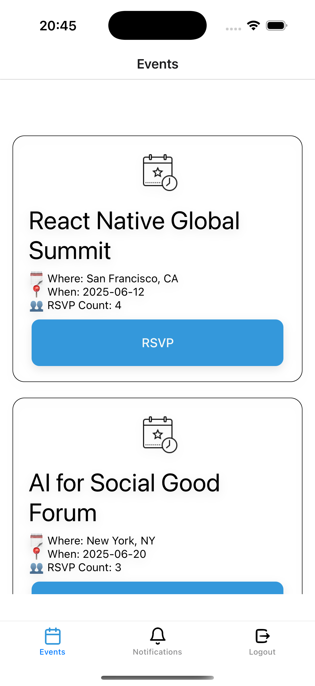

# 🎉 Events App

A beautifully designed public mobile app that allows users to RSVP to upcoming events, receive notifications, and enjoy seamless navigation — powered by a JSON-based Node.js backend.

---

## 🚀 Features

### 📱 Mobile App

- ✔️ Browse and explore events with images  
- 📋 RSVP to events with a guest count  
- 🔔 Push notifications for upcoming events  
- 🔗 Deep linking support (e.g. `myapp://event/123`)  

### 🛠 Backend API

- REST API endpoints for event operations  
- User authentication via `/login`  
- JSON file-based persistence  

---

## 📱 Screens

- 🏠 EventsScreen  
- 🗓 EventDetailsScreen  
- 🔔 NotificationsScreen  
- 🚀 OnBoardingScreen  
- 🔑 SignInScreen  
- 💧 SplashScreen  

---

## 🧩 API Endpoints

| Method | Endpoint | Description |
|--------|----------|-------------|
| GET    | `/events` | Fetch all events |
| GET    | `/events/:id` | Fetch event by ID |
| POST   | `/events/:id/rsvp` | RSVP to an event |
| PATCH  | `/events/:id/rsvp` | Update RSVP |
| DELETE | `/events/:id/rsvp` | Cancel RSVP |
| POST   | `/login` | User login |

---

## 🔧 Environment

Environment variables can be stored in a `.env` file.  
Example variables:
```
PORT=3000
BASE_URL=http://localhost:3000
```

---

## 🛠 Installation & Usage

```bash
# Clone the repository
git clone https://github.com/YOUR_USERNAME/Events-App.git

# Install dependencies
cd Events-App/frontend
npm install

cd ../backend
npm install

# Run backend
npm run dev

# Run mobile app
npm run android    # for Android
npm run ios        # for iOS
```

---

## 🧱 Tech Stack

### Frontend
- React Native  
- Redux Toolkit
- RTK Query
- TypeScript  
- React Navigation
- Bottom Tab Navigation

### Backend
- Node.js  
- Express  
- TypeScript  
- tsx (live reload)

---

## 🖼️ App Screenshots

<table>
  <tr>
    <td align="center">
      <br/>
      <sub>Splash Screen</sub>
    </td>
    <td align="center">
      <br/>
      <sub>Onboarding</sub>
    </td>
    <td align="center">
      <br/>
      <sub>Login</sub>
    </td>
  </tr>
  <tr>
    <td align="center">
      <br/>
      <sub>Events List</sub>
    </td>
    <td align="center">
      <br/>
      <sub>Event Details</sub>
    </td>
 <td align="center">
      <br/>
      <sub>Event Details Before RSVP</sub>
    </td>
    <td align="center">
      <br/>
      <sub>Notifications</sub>
    </td>
  </tr>
  <tr>
    <td align="center" colspan="3">
      <br/>
      <sub>Push Notification Preview</sub>
    </td>
  </tr>
</table>

---

## 📲 Deep Linking & Push Notification Testing

You can simulate a push notification or deep link by using the following command in your terminal (Mac only, for iOS simulator):

```bash
xcrun simctl openurl booted rsvpevents://event/4
```
Or Using adb in android simulator

```bash
adb shell am start -W -a android.intent.action.VIEW -d "rsvpevents://events/4" com.frontend
```

This will open the app in the simulator and navigate directly to the event with ID `4`, mimicking the behavior of a notification or link click.

### ✅ Prerequisites

- Xcode and iOS Simulator must be installed.
- The app must already be built and installed in the simulator.
- The app must be configured to handle the `rsvpevents://` scheme via `react-navigation` and `linking`.

For more info, see [React Navigation Deep Linking Docs](https://reactnavigation.org/docs/deep-linking/)

---

## 📄 License

This project is licensed under the **MIT License**.

---

## ⭐ GitHub

[View Repository →](https://github.com/YOUR_USERNAME/Events-App)
